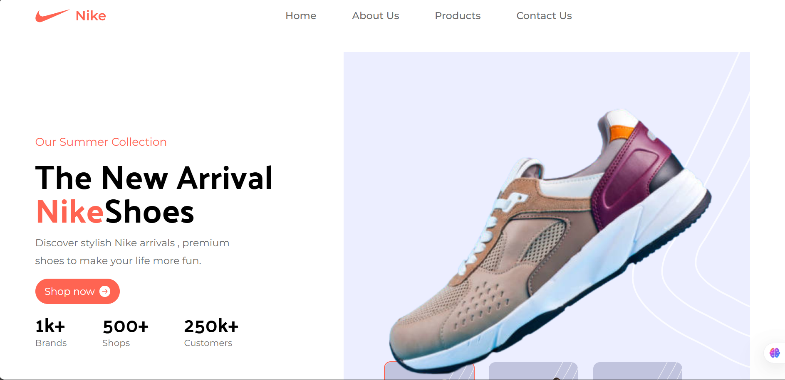

# Nike Landing Page
## Preview

## Tech Stack
- **React** - Frontend library
- **Tailwind CSS** - Utility-first CSS framework
- **Vite** - Build tool and development server

## Quick Start Guide

### Prerequisites
- Node.js (v14 or higher)
- VS Code
- Git

### Installation & Setup

1. **Clone the repository**
   ```bash
   git clone <your-repo-url>
   cd nike-landing-page
   ```

2. **Install dependencies**
   ```bash
   npm install
   ```

3. **Start development server**
   ```bash
   npm run dev
   ```

4. **Open in VS Code**
   ```bash
   code .
   ```

### VS Code Setup
- Install recommended extensions:
  - ES7+ React/Redux/React-Native snippets
  - Tailwind CSS IntelliSense
  - Prettier - Code formatter
  - Auto Rename Tag

### Project Structure
```
src/
├── components/        # Reusable components
├── sections/         # Page sections
├── constants/        # Constants and data
├── App.jsx          # Main app component
├── index.css       # Custom styles and fonts
└── main.jsx        # Main import file
```

## Development
The project uses Vite's hot reload for fast development. Make changes to your components and see them instantly reflected in the browser.

## Build & Deploy
```bash
npm run build
npm run preview
```

## License
MIT